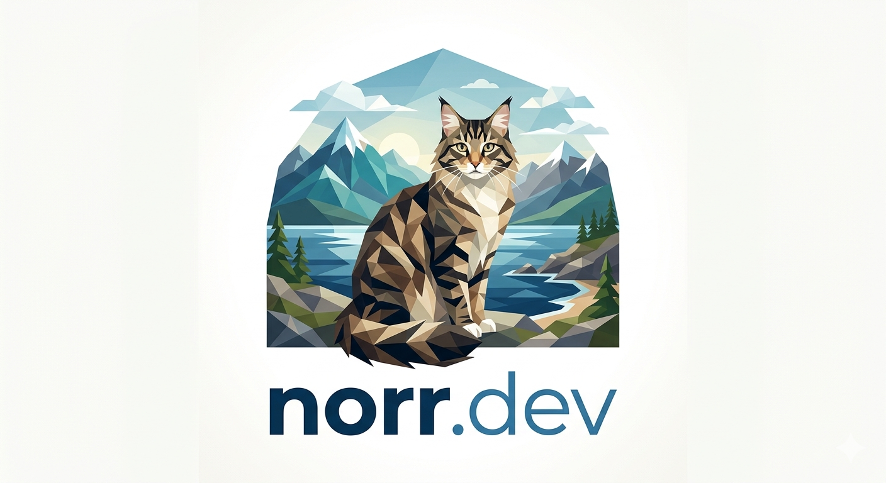

  

  # NorrDev

  ### Crafting side-projects and open-source solutions.

  
  

  ---

## About
NorrDev is a personal laboratory for exploring new technologies, building useful tools, and contributing to the open-source ecosystem.

## Projects
We build things across different domains:
- **Open Source:** Tools and libraries for the community.
- **Side Projects:** Niche applications and experimental web tech.
- **Internal Tools:** Automations and utilities.

## Connect
- **Website:** [norr.dev](https://norr.dev)
- **Email:** [mail@norr.dev](mailto:mail@norr.dev)

---

  Built with ❄️ by NorrDev

